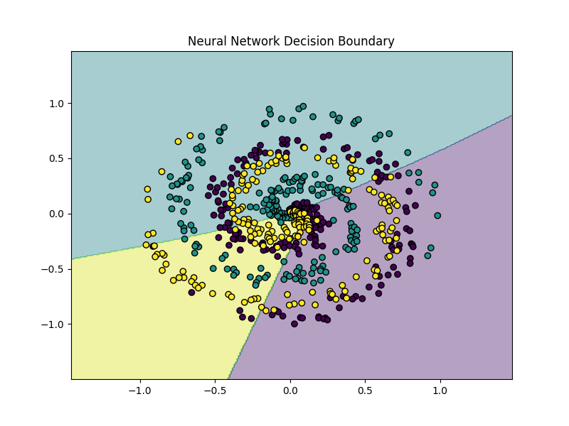

# README.md


# Neural Network From Scratch

A beginner-friendly deep learning project that builds a fully functional neural network using only NumPy.

No PyTorch.
No TensorFlow.
No high-level AI frameworks.

This project teaches how neural networks actually work internally.

---

# Why This Project Matters

Modern AI frameworks automate nearly everything.

When you train a neural network using PyTorch or TensorFlow, the framework automatically:

- computes gradients
- performs backpropagation
- updates weights
- tracks losses
- optimizes parameters

This convenience is powerful.

But it can also hide how deep learning actually works.

This project removes the abstraction.

You will manually implement:

- forward propagation
- backpropagation
- activation functions
- gradient descent
- weight updates
- loss computation

By the end, neural networks will no longer feel like magic.

---

# What Is a Neural Network?

A neural network is a mathematical function that learns patterns from data.

It consists of layers of neurons.

Each neuron:

1. receives inputs
2. multiplies them by weights
3. adds biases
4. applies an activation function
5. passes outputs forward

This process repeats layer after layer.

---

# Core Deep Learning Concepts

## 1. Forward Propagation

Forward propagation is the process of sending information through the neural network to produce a prediction.

You can think of it as:

> the network “thinking” or making a guess

Data moves layer by layer through the network:

```text
Input → Hidden Layer → Output Layer
```

Each layer transforms the data into a more useful representation.

---

# A Simple Intuition

Imagine teaching a neural network to recognize handwritten digits.

The input image might first enter neurons that detect:

* edges
* curves
* corners

Later layers combine those simpler patterns into more advanced ones:

* loops
* shapes
* full numbers

Eventually the network outputs probabilities like:

```text id="z3e18g"
0 -> 0.01
1 -> 0.02
2 -> 0.91
3 -> 0.03
...
```

The network predicts:

```text id="0b2u79"
2
```

because it has the highest probability.

All of that happens during forward propagation.

---

# What Happens Inside a Neuron?

Each neuron performs a mathematical operation.

The core equation is:

```text id="2gh1ku"
output = input · weights + bias
```

This operation is called a **dense layer** or **fully connected layer**.

---

# Breaking Down the Equation

## Inputs

Inputs are the information entering the neuron.

Examples:

* pixel values in an image
* words in a sentence
* sensor measurements
* stock prices

Example:

```text id="qub0rr"
input = [2, 5]
```

---

## Weights

Weights determine how important each input is.

Example:

```text id="3i3g7l"
weights = [0.4, -0.2]
```

The network learns these weights during training.

You can think of weights as:

> adjustable importance values

Large positive weight:

* strongly increases output

Large negative weight:

* strongly decreases output

Small weight:

* weak influence

---

## Dot Product

The neuron multiplies inputs and weights:

```text id="5pkdct"
(2 × 0.4) + (5 × -0.2)
```

Result:

```text id="nlq61x"
0.8 - 1.0 = -0.2
```

This operation is called the **dot product**.

The dot product is one of the most important operations in AI.

Modern GPUs are heavily optimized for huge numbers of matrix multiplications.

---

## Bias

Then we add a bias term:

```text id="w0lh3t"
output = -0.2 + bias
```

The bias helps shift the neuron output.

You can think of bias as:

* a flexibility adjustment
* an offset
* a threshold controller

Without biases, neural networks would be much less expressive.

---

# Why Forward Propagation Matters

Forward propagation is how the network produces predictions.

Without it:

* no outputs
* no predictions
* no learning

Training always begins with:

1. forward propagation
2. measure error
3. improve parameters

---

## 2. Activation Functions

A neural network is made of layers of mathematical operations.

At its core, each neuron does something like this:

```text
output = input · weights + bias
```

This is just a linear equation.

A problem appears if we stack many layers together **without** activation functions.

Even with multiple layers, the entire network still behaves like one giant linear equation.

That means the network could only learn simple patterns like straight lines.

---

# Why Linear Models Are Limited

Imagine trying to separate two groups of points.

A linear model can only draw a straight line:

```text
-----------
```

But real-world data is rarely that simple.

AI systems often need to recognize:

* curved boundaries
* complicated shapes
* nonlinear relationships
* hidden patterns

Examples:

* distinguishing cats from dogs
* speech recognition
* handwriting recognition
* language understanding

These problems cannot usually be solved with straight lines alone.

---

# Activation Functions Add Nonlinearity

Activation functions transform neuron outputs in nonlinear ways.

This allows neural networks to bend, curve, and reshape decision boundaries.

Instead of only learning straight lines, the network can now learn:

* curves
* clusters
* complex shapes
* hierarchical patterns

This is one of the key reasons deep learning works.

Without activation functions:

```text
Deep Neural Network = Linear Model
```

With activation functions:

```text
Deep Neural Network = Powerful Pattern Learner
```

---

# ReLU Activation

This project uses the ReLU activation function.

## Formula

```text
ReLU(x) = max(0, x)
```

This means:

* if `x > 0` → keep the value
* if `x <= 0` → output 0

Examples:

```text
ReLU(5)   = 5
ReLU(2.3) = 2.3
ReLU(-4)  = 0
ReLU(-1)  = 0
```

---

# Why ReLU Is Useful

ReLU helps neural networks in several important ways.

## 1. Introduces Nonlinearity

This allows the network to learn complex relationships.

---

## 2. Computationally Simple

ReLU is extremely fast:

```python
max(0, x)
```

This matters because modern AI systems perform billions of operations.

---

## 3. Helps Deep Networks Train

Older activation functions sometimes caused gradients to become extremely small.

This made learning very slow.

ReLU reduces this problem and helped enable modern deep learning.

---

# Intuition for ReLU

You can think of ReLU as an on/off switch.

* positive signals pass through
* negative signals are blocked

This helps networks focus on useful features.

For example in image recognition:

* one neuron may activate for edges
* another for circles
* another for eyes
* another for textures

ReLU helps neurons selectively activate for important patterns.

---

# 3. Softmax

The final layer of a classification network usually produces raw scores.

These are often called:

* logits
* scores
* unnormalized predictions

Example:

```text
[2.1, 0.3, 1.2]
```

These numbers are not probabilities yet.

They:

* can be larger than 1
* can be negative
* do not sum to 1

This makes them difficult to interpret.

---

# What Softmax Does

Softmax converts raw scores into probabilities.

For example:

```text
[2.1, 0.3, 1.2]
```

becomes:

```text
[0.65, 0.09, 0.26]
```

Now:

* every value is between 0 and 1
* all probabilities sum to 1
* the largest probability becomes the prediction

---

# Intuition Behind Softmax

Softmax turns scores into a probability distribution.

You can think of it as:

> “How confident is the network in each class?”

Example:

```text
Cat  -> 0.80
Dog  -> 0.15
Bird -> 0.05
```

The network predicts:

```text
Cat
```

because it has the highest probability.

---

# Why Softmax Is Important

Without Softmax:

```text
[12.4, -3.2, 8.1]
```

is hard to interpret.

With Softmax:

```text
[0.97, 0.001, 0.029]
```

the prediction becomes meaningful.

This is why Softmax is commonly used in:

* image classifiers
* language models
* speech recognition
* recommendation systems

---

# 4. Loss Functions

The network makes predictions.

But how does it know whether those predictions are good or bad?

That is the role of the loss function.

---

# What Is a Loss Function?

A loss function measures prediction error.

It answers:

> “How wrong is the network?”

Lower loss means:

* better predictions
* better learning
* improved performance

Higher loss means:

* poor predictions
* incorrect classifications
* more learning needed

---

# Training Goal

Neural network training is essentially:

```text
minimize loss
```

The optimizer repeatedly adjusts weights to reduce the loss.

---

# Cross-Entropy Loss

This project uses cross-entropy loss.

Cross-entropy is the standard loss function for classification tasks.

It compares:

* predicted probabilities
* correct answers

and measures how different they are.

---

# Intuition Behind Cross-Entropy

Suppose the correct answer is:

```text
Dog
```

and the network predicts:

```text
Cat  -> 0.90
Dog  -> 0.05
Bird -> 0.05
```

This is very bad.

The network is:

* highly confident
* strongly wrong

Cross-entropy gives a very large penalty.

---

# Example of Good Prediction

Correct answer:

```text
Dog
```

Prediction:

```text
Cat  -> 0.02
Dog  -> 0.95
Bird -> 0.03
```

This is good.

The network is:

* confident
* correct

Cross-entropy gives a very small loss.

---

# Why This Matters

Cross-entropy teaches the network:

* be correct
* be confident when correct
* avoid confident mistakes

This is critical for effective learning.

---

# 5. Backpropagation

Forward propagation produces predictions.

But how does the network improve?

That is the role of backpropagation.

Backpropagation is the algorithm that teaches the network how to learn.

---

# The Main Idea

The network makes a prediction.

Then it asks:

> “Which weights caused the mistake?”

Backpropagation calculates how much each parameter contributed to the error.

Then it sends that information backward through the network.

---

# Why This Is Necessary

A neural network may contain:

* thousands
* millions
* billions

of parameters.

We need an efficient way to determine:

* which parameters helped
* which hurt
* how to adjust them

Backpropagation solves this problem.

---

# Intuition for Backpropagation

Imagine taking a math test.

You get a question wrong.

Your teacher explains:

* exactly where the mistake happened
* which steps were incorrect
* how much each mistake mattered

Backpropagation does the same thing for neural networks.

It traces prediction errors backward through the layers.

---

# Gradients

The key idea in backpropagation is the **gradient**.

A gradient tells us:

```text id="n0yk7g"
How much would the loss change
if this parameter changed slightly?
```

Large gradient:

* parameter strongly affects error

Small gradient:

* parameter has little effect

The network uses these gradients to learn.

---

# Chain Rule (Intuition Only)

Backpropagation uses a calculus concept called the chain rule.

The chain rule helps compute how changes propagate through multiple layers.

Fortunately, you do not need advanced calculus intuition to understand the big idea.

Conceptually:

```text id="wx0uw0"
error flows backward through the network
```

Each layer receives feedback about:

* how wrong it was
* how much it contributed to the final prediction

---

# Why Backpropagation Was Revolutionary

Before backpropagation, training deep neural networks was extremely difficult.

Backpropagation made it possible to efficiently train large multilayer networks.

Modern AI breakthroughs rely heavily on it:

* ChatGPT
* image generators
* speech recognition
* AlphaGo
* self-driving systems

All of them use backpropagation.

---

# 6. Gradient Descent

After backpropagation computes gradients, the network must improve its parameters.

That process is called gradient descent.

Gradient descent is the optimization algorithm that powers most modern AI.

---

# Core Idea

The network wants to reduce loss.

It does this by slightly adjusting weights in the direction that decreases error.

---

# Weight Update Rule


```text
w = w - η ∇L
```

Where:

- `w` = weight
- `η` = learning rate
- `∇L` = gradient of the loss

In plain English:

> new weight = old weight − small step toward lower error

---

# Intuition for Gradient Descent

Imagine standing on a mountain in heavy fog.

You want to reach the bottom.

You cannot see the whole mountain.

But you *can* feel the slope beneath your feet.

So you:

1. check which direction slopes downward
2. take a small step downhill
3. repeat

Eventually you reach a low point.

That is gradient descent.

---

# Why the Learning Rate Matters

The learning rate controls step size.

Small learning rate:

* slow learning
* stable updates

Large learning rate:

* faster movement
* possible instability
* may overshoot the minimum

Too large:

```text id="k75ynz"
network may diverge
```

Too small:

```text id="zbg78z"
training may become painfully slow
```

Choosing a good learning rate is one of the most important parts of training neural networks.

---

# The Full Training Loop

Deep learning is essentially this repeated cycle:

```text id="6h0hbw"
1. Forward propagation
2. Compute loss
3. Backpropagation
4. Compute gradients
5. Gradient Descent (Weight Updates)
6. Repeat
```

This process may repeat:

* thousands of times
* millions of times
* billions of times

until the network gradually improves.

---

# Important Insight

Modern deep learning systems may appear incredibly complicated.

But fundamentally, nearly all of them are repeatedly doing:

```text id="dyzw2k"
predict → measure error → adjust weights
```

That simple loop is the foundation of modern AI.

---

# The Full Learning Pipeline

The complete neural network process looks like this:

```text
Input Data
    ↓
Dense Layers
    ↓
Activation Functions
    ↓
Softmax Probabilities
    ↓
Loss Function
    ↓
Backpropagation
    ↓
Gradient Descent (Weight Updates)
    ↓
Improved Predictions
```

This loop repeats thousands or millions of times during training.

That process is the foundation of modern deep learning.

---

# Dataset

This project uses a synthetic spiral dataset.

Why?

Because spiral data is:

* small
* visual
* nonlinear
* difficult for linear models

This makes it perfect for understanding neural networks.

---

# What You Will Build

A neural network that:

* classifies spiral data
* computes gradients manually
* trains using backpropagation
* tracks loss and accuracy
* visualizes learning progress
* generates decision boundaries

---

# Output Visualizations

The project saves:

```text
output/
├── training_loss.png
├── training_accuracy.png
└── predictions.png
```

These visualizations help you see how learning evolves.

---
# How to Run

## 1. change directory into project 3

### macOS/Linux

```bash
cd 01-python-foundations/project_4_neural_network/
```

## 2. Create Virtual Environment

### macOS/Linux

```bash
python3 -m venv .venv
source .venv/bin/activate
```

### Windows

```bash
python -m venv .venv
.venv\\Scripts\\activate
```

---

## 3. Install Dependencies

```bash
pip install -r requirements.txt
```

---

## 4. Run the Project

```bash
python main.py
```

---

## Project Structure

```text
neural_network_from_scratch/
│
├── main.py
├── network.py
├── layers.py
├── activations.py
├── losses.py
├── data.py
├── visualization.py
├── requirements.txt
├── output/
│   ├── training_loss.png
│   ├── training_accuracy.png
│   └── predictions.png
└── README.md
```

---

# requirements.txt

```text
numpy
matplotlib
```

---

# Expected Training Behavior

During training you should observe:

* loss decreasing
* accuracy increasing
* decision boundaries improving

This means the network is learning patterns from data.

---

# Important AI Insight

Large modern AI systems are built from the same principles used here.

GPT models, image generators, and computer vision systems all rely on:

* matrix multiplication
* activations
* gradients
* backpropagation
* optimization

The difference is scale.

This small project contains the same fundamental learning mechanics as modern deep learning.

---

# Suggested Experiments

## Try Different Learning Rates

In `main.py`:

```python
learning_rate=0.001
```

or:

```python
learning_rate=1.0
```

Observe:

* slow learning
* fast learning
* unstable learning

---

## Change Hidden Layer Size

Try:

```python
hidden_size=8
```

or:

```python
hidden_size=128
```

Larger networks can learn more complex patterns.

---

## Add More Layers

Try implementing:

* another dense layer
* sigmoid activation
* tanh activation
* dropout

This is how deeper networks are built.

---

# My Results



### Architecture
- Input layer: 2 features
- Hidden layers: 256 → 128 → 64 neurons
- Activation function: ReLU (between all hidden layers)
- Output layer: 3 classes
- Output activation: Softmax (probability distribution)

### Training 
- 20,000 Epochs
- Learning Rate: 0.2
- Optimization: gradient descent with manual backpropagation
- Loss function: cross-entropy

# Recommended Next Projects

After this project, consider learning:

1. Convolutional Neural Networks (CNNs)
2. PyTorch Autograd
3. Transformers
4. Attention Mechanisms
5. Residual Networks
6. Reinforcement Learning

---

# Expected Learning Outcome

After completing this project, you should understand:

* how neural networks compute outputs
* how backpropagation works
* how gradients are calculated
* how parameters learn
* why activation functions matter
* how deep learning frameworks operate internally

You will now understand what PyTorch and TensorFlow are doing behind the scenes.
